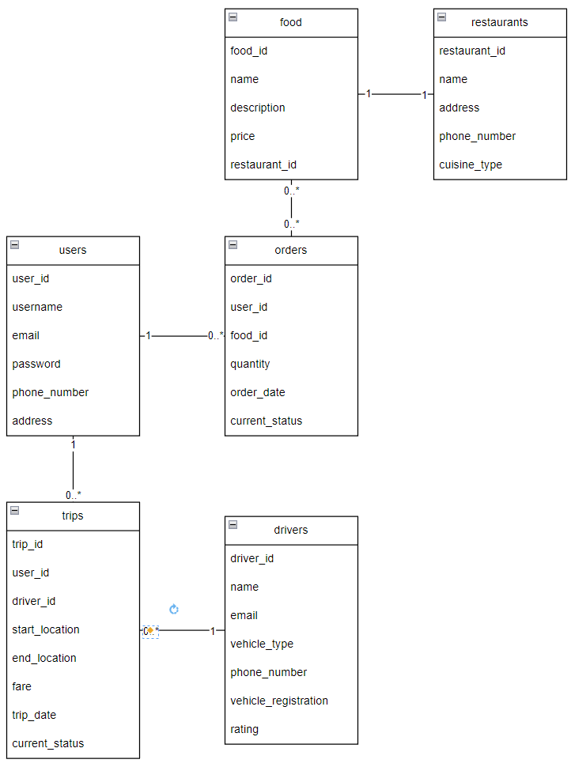

# SE-Backend-Assignment

SE Backend Assignment for Backend Engineer Application

## About the Project

This project is a simple REST API, built with modular monolith architecture, that consist of user service, gofood-like service, and goride-like service. CRUD operations can be done on each service. The project is built using Node.js, Express.js, and PostgreSQL.

Other than mentioned above, Gojek App also have various services such as GoSend, GoMart, GoPay, GoCar, GoTransit, GoBluebird, and GoClub.

### Data Structure

#### User Service

- User
  - id
  - username
  - email
  - password
  - phone_number
  - address

#### GoRide-like Service

- Drivers

  - driver_id
  - name
  - email
  - phone_number
  - vehicle_type
  - vehicle_registration
  - rating

- Trips
  - trip_id
  - user_id
  - driver_id
  - start_location
  - end_location
  - fare
  - trip_date
  - current_status

#### GoFood-like Service

- Restaurants

  - restaurant_id
  - name
  - address
  - phone_number
  - cuisine_type

- Food

  - food_id
  - name
  - description
  - price
  - restaurant_id

- Orders
  - order_id
  - user_id
  - food_id
  - quantity
  - order_date
  - current_status

### Data Model

## Getting Started

### Prerequisites

- Node.js
- PostgreSQL

### Installation

#### Services

Refer to each service's README for installation instructions.

#### Database

Use the dumped .sql [here.](./sql/be_service_dump.sql) Create postgres user `be_service` with pass `12345678` and createdb permission to use.

## Usage

OpenAPI documentation can be found for each service at the following URL: `http://localhost:3000/api-docs` (replace `3000` with the port number of the service).

- User service: 2431
- GoRide-like service: 2432
- GoFood-like service: 2433

## Contact

Dzaky Fattan Rizqullah - [dzaky.fattan@gmail.com](mailto:dzaky.fattan@gmail.com)
